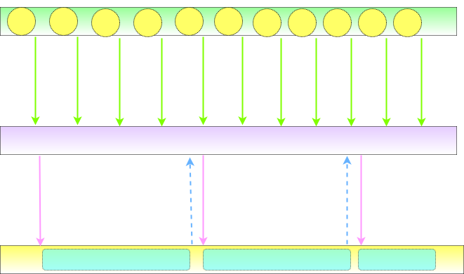

# FastSharedPreferences——高性能Android key-value组件
FastSharedPreferences是一个Android平台的高性能Android key-value组件。
## FastSharedPreferences特点
1. 实现了SharedPreferences和SharedPreferences.Editor接口，便于无缝替换SharedPreferences。
2. 增强了SharedPreferences，增加了写入/读取Serializable的接口。
3. 高效的写入/读取性能，读写性能相比SharedPreferences增强了200-300倍
4. 纯java实现，很好的兼容性和稳定性
5. 实现代码简洁，aar体积很小
6. 目前只支持单进程使用

## FastSharedPreferences原理
- **适合高强度/高频次写入读取**

    FastSharedPreferences由Cache层和同步层构成，特别适合高强度/高频次写入读取数据。
- **内存Cache**

    基于ConcurrentHashMap的内存Cache层，不仅提高了写入性能，也极大的提高了读取性能。
- **同步管理**

    通过脏数据标记等技术，减少了同步的次数，使得慢速的I/O不再成为读写速度的瓶颈。


## FastSharedPreferences使用指南
### 接入

```
dependencies {
    compile 'com.jeremyliao:fast-sharedpreferences:0.0.1'
}
```

### 快速上手
##### 在application onCreate中初始化：

```
FastSharedPreferences.init(context);
```

##### 用法和SharedPreferences几乎完全一致，例如：
- [x] 写入一个整数

```
FastSharedPreferences sharedPreferences = FastSharedPreferences.get(FSP_ID);
sharedPreferences.edit().putInt("test_key", 100).apply();
```
- [x] 读取一个整数

```
FastSharedPreferences sharedPreferences = FastSharedPreferences.get(FSP_ID);
        int ret = sharedPreferences.getInt("test_key", -1);
```

## 性能对比
我们将 FastSharedPreferences同 SharedPreferences、SQLite以及腾讯的MMKV进行对比，测试的结果是对每项测试重复200次取平均值（对SharedPreferences和SQLite没有重复这么多次，因为时间太长了:)）。相关测试代码参见[benchmark](https://github.com/JeremyLiao/FastSharedPreferences/tree/master/FastSharedPreferences/app/src/main/java/com/jeremy/fspdemo/benchmark)。

- 写入1000个整数


（测试机器是 Nexus 6 64G，Android 7.1.1，每组操作重复 200次，时间单位是 ms）

- 读取1000个整数


（测试机器是 Nexus 6 64G，Android 7.1.1，每组操作重复 200次，时间单位是 ms）